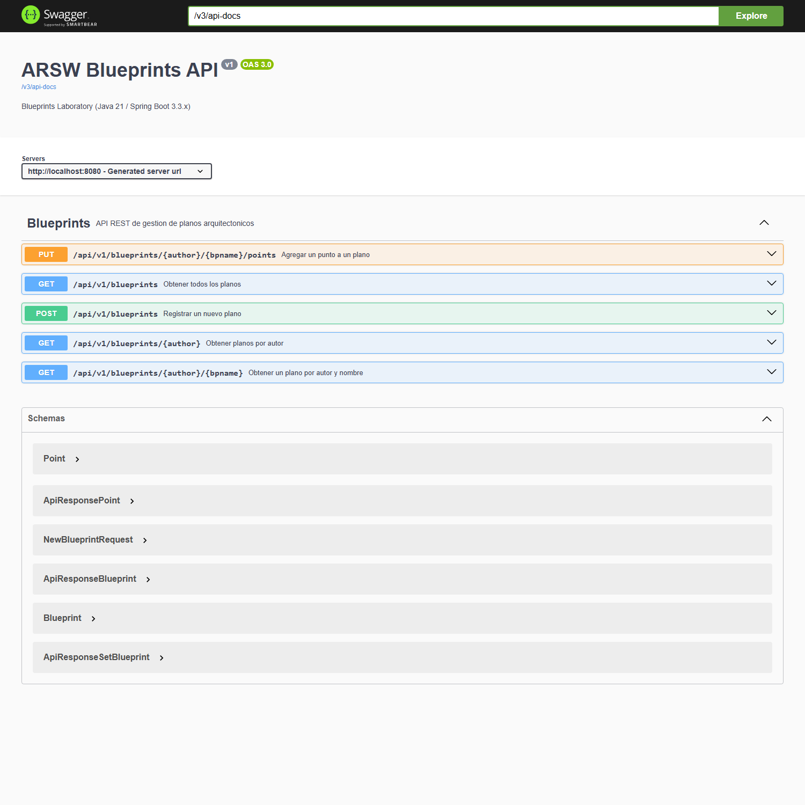
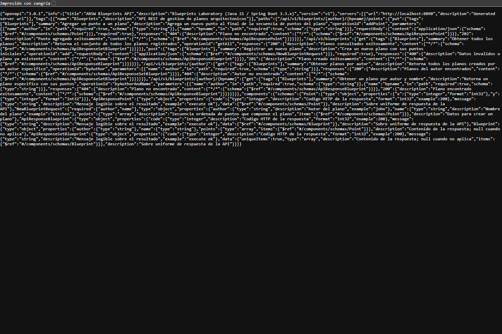
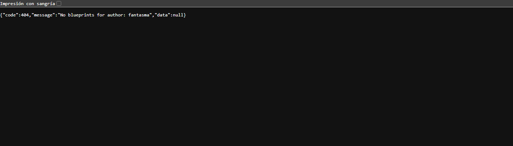
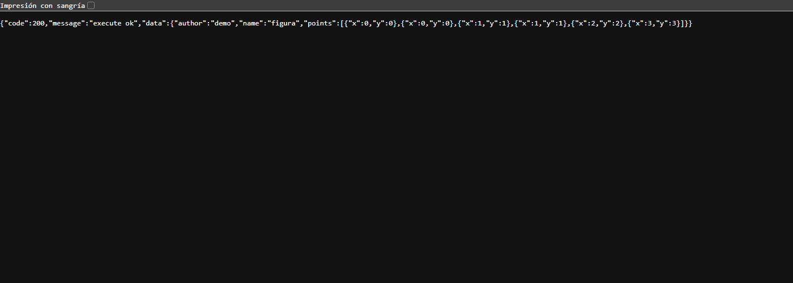
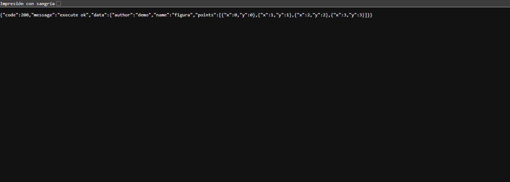
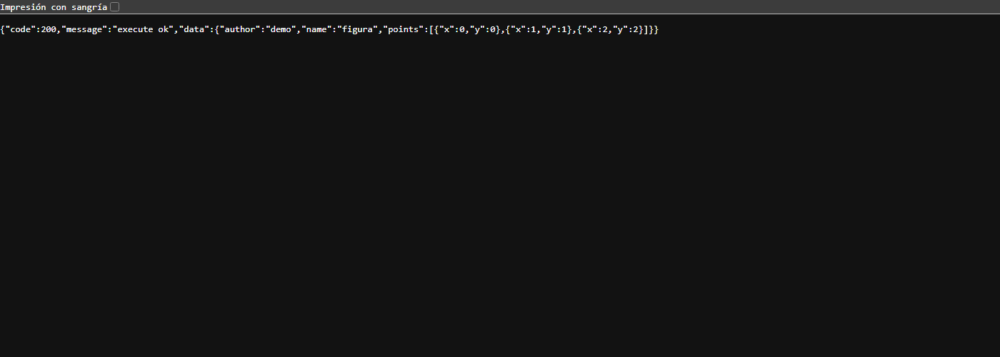
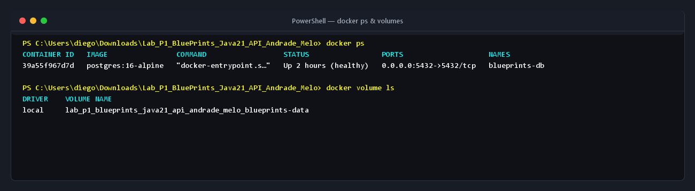
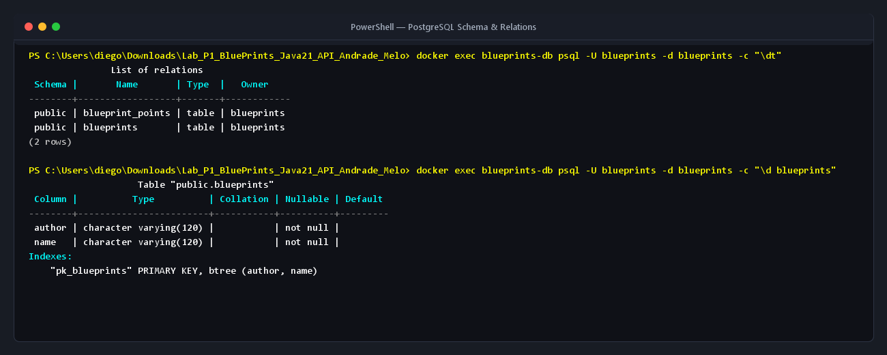
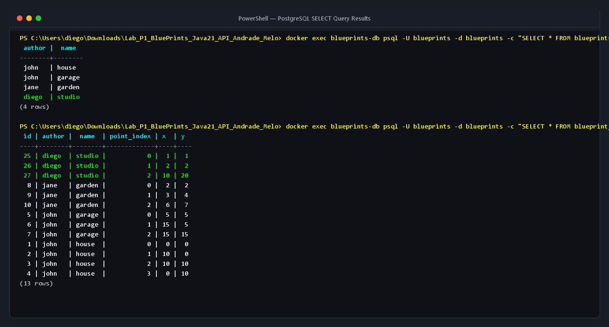

# Evidencias de ejecucion

Transcripciones reales de peticiones HTTP contra la API, capturadas el 2026-08-27 17:36.
Aplicacion ejecutada con `--spring.profiles.active=inmemory` en `http://localhost:8080`.

## 1. Codigos HTTP y sobre `ApiResponse`

| # | Escenario | Peticion | Esperado | Obtenido |
|---|---|---|---|---|
| 1 | Listar todos los planos | `GET /api/v1/blueprints` | 200 | **200** OK |
| 2 | Planos de un autor | `GET /api/v1/blueprints/john` | 200 | **200** OK |
| 3 | Un plano concreto | `GET /api/v1/blueprints/john/house` | 200 | **200** OK |
| 4 | Autor inexistente | `GET /api/v1/blueprints/fantasma` | 404 | **404** OK |
| 5 | Plano inexistente | `GET /api/v1/blueprints/john/nada` | 404 | **404** OK |
| 6 | Crear un plano | `POST /api/v1/blueprints` | 201 | **201** OK |
| 7 | Crear un plano duplicado | `POST /api/v1/blueprints` | 400 | **400** OK |
| 8 | Crear sin autor (validacion) | `POST /api/v1/blueprints` | 400 | **400** OK |
| 9 | Cuerpo JSON mal formado | `POST /api/v1/blueprints` | 400 | **400** OK |
| 10 | Agregar un punto | `PUT /api/v1/blueprints/john/house/points` | 202 | **202** OK |
| 11 | Agregar punto a plano inexistente | `PUT /api/v1/blueprints/john/nada/points` | 404 | **404** OK |
| 12 | Ruta antigua (sin versionar) | `GET /blueprints` | 404 | **404** OK |
| 13 | Metodo no permitido | `DELETE /api/v1/blueprints/john/house` | 405 | **405** OK |

### Detalle de cada peticion

### 1. Listar todos los planos

```http
GET /api/v1/blueprints
```

Respuesta **200**:

```json
{
    "code":  200,
    "message":  "execute ok",
    "data":  [
                 {
                     "author":  "john",
                     "name":  "house",
                     "points":  [
                                    {
                                        "x":  0,
                                        "y":  0
                                    },
                                    {
                                        "x":  10,
                                        "y":  0
                                    },
                                    {
                                        "x":  10,
                                        "y":  10
                                    },
                                    {
                                        "x":  0,
                                        "y":  10
                                    }
                                ]
                 },
                 {
                     "author":  "john",
                     "name":  "garage",
                     "points":  [
                                    {
                                        "x":  5,
                                        "y":  5
                                    },
                                    {
                                        "x":  15,
                                        "y":  5
                                    },
                                    {
                                        "x":  15,
                                        "y":  15
                                    }
                                ]
                 },
                 {
                     "author":  "jane",
                     "name":  "garden",
                     "points":  [
                                    {
                                        "x":  2,
                                        "y":  2
                                    },
                                    {
                                        "x":  3,
                                        "y":  4
                                    },
                                    {
                                        "x":  6,
                                        "y":  7
                                    }
                                ]
                 }
             ]
}
```

### 2. Planos de un autor

```http
GET /api/v1/blueprints/john
```

Respuesta **200**:

```json
{
    "code":  200,
    "message":  "execute ok",
    "data":  [
                 {
                     "author":  "john",
                     "name":  "house",
                     "points":  [
                                    {
                                        "x":  0,
                                        "y":  0
                                    },
                                    {
                                        "x":  10,
                                        "y":  0
                                    },
                                    {
                                        "x":  10,
                                        "y":  10
                                    },
                                    {
                                        "x":  0,
                                        "y":  10
                                    }
                                ]
                 },
                 {
                     "author":  "john",
                     "name":  "garage",
                     "points":  [
                                    {
                                        "x":  5,
                                        "y":  5
                                    },
                                    {
                                        "x":  15,
                                        "y":  5
                                    },
                                    {
                                        "x":  15,
                                        "y":  15
                                    }
                                ]
                 }
             ]
}
```

### 3. Un plano concreto

```http
GET /api/v1/blueprints/john/house
```

Respuesta **200**:

```json
{
    "code":  200,
    "message":  "execute ok",
    "data":  {
                 "author":  "john",
                 "name":  "house",
                 "points":  [
                                {
                                    "x":  0,
                                    "y":  0
                                },
                                {
                                    "x":  10,
                                    "y":  0
                                },
                                {
                                    "x":  10,
                                    "y":  10
                                },
                                {
                                    "x":  0,
                                    "y":  10
                                }
                            ]
             }
}
```

### 4. Autor inexistente

```http
GET /api/v1/blueprints/fantasma
```

Respuesta **404**:

```json
{
    "code":  404,
    "message":  "No blueprints for author: fantasma",
    "data":  null
}
```

### 5. Plano inexistente

```http
GET /api/v1/blueprints/john/nada
```

Respuesta **404**:

```json
{
    "code":  404,
    "message":  "Blueprint not found: john/nada",
    "data":  null
}
```

### 6. Crear un plano

```http
POST /api/v1/blueprints
Content-Type: application/json

{"author":"tester","name":"cocina","points":[{"x":1,"y":1},{"x":2,"y":2}]}
```

Respuesta **201**:

```json
{
    "code":  201,
    "message":  "blueprint created",
    "data":  {
                 "author":  "tester",
                 "name":  "cocina",
                 "points":  [
                                {
                                    "x":  1,
                                    "y":  1
                                },
                                {
                                    "x":  2,
                                    "y":  2
                                }
                            ]
             }
}
```

### 7. Crear un plano duplicado

```http
POST /api/v1/blueprints
Content-Type: application/json

{"author":"tester","name":"cocina","points":[]}
```

Respuesta **400**:

```json
{
    "code":  400,
    "message":  "Blueprint already exists: tester:cocina",
    "data":  null
}
```

### 8. Crear sin autor (validacion)

```http
POST /api/v1/blueprints
Content-Type: application/json

{"author":"","name":"x","points":[]}
```

Respuesta **400**:

```json
{
    "code":  400,
    "message":  "datos invalidos",
    "data":  {
                 "author":  "el autor es obligatorio"
             }
}
```

### 9. Cuerpo JSON mal formado

```http
POST /api/v1/blueprints
Content-Type: application/json

{esto no es json}
```

Respuesta **400**:

```json
{
    "code":  400,
    "message":  "cuerpo de la peticion invalido o mal formado",
    "data":  null
}
```

### 10. Agregar un punto

```http
PUT /api/v1/blueprints/john/house/points
Content-Type: application/json

{"x":3,"y":3}
```

Respuesta **202**:

```json
{
    "code":  202,
    "message":  "update accepted",
    "data":  {
                 "x":  3,
                 "y":  3
             }
}
```

### 11. Agregar punto a plano inexistente

```http
PUT /api/v1/blueprints/john/nada/points
Content-Type: application/json

{"x":3,"y":3}
```

Respuesta **404**:

```json
{
    "code":  404,
    "message":  "Blueprint not found: john/nada",
    "data":  null
}
```

### 12. Ruta antigua (sin versionar)

```http
GET /blueprints
```

Respuesta **404**:

```json
{
    "code":  404,
    "message":  "recurso no encontrado",
    "data":  null
}
```

### 13. Metodo no permitido

```http
DELETE /api/v1/blueprints/john/house
```

Respuesta **405**:

```json
{
    "code":  405,
    "message":  "Request method \u0027DELETE\u0027 is not supported",
    "data":  null
}
```


---

## 2. Filtros de puntos activados por perfil

Se envio el mismo plano a cuatro instancias de la aplicacion, cada una arrancada con
distintos perfiles activos:

```json
{ "author":"demo", "name":"figura",
  "points":[{"x":0,"y":0},{"x":0,"y":0},{"x":1,"y":1},{"x":1,"y":1},{"x":2,"y":2},{"x":3,"y":3}] }
```

Resultado de `GET /api/v1/blueprints/demo/figura` en cada caso:

| Perfiles activos | Puntos devueltos | Total | Captura |
|---|---|---|---|
| *(ninguno)* | `(0,0) (0,0) (1,1) (1,1) (2,2) (3,3)` | 6 | `evidencias/05-filtro-ninguno.png` |
| `redundancy` | `(0,0) (1,1) (2,2) (3,3)` | 4 | `evidencias/06-filtro-redundancy.png` |
| `undersampling` | `(0,0) (1,1) (2,2)` | 3 | `evidencias/07-filtro-undersampling.png` |
| `redundancy,undersampling` | `(0,0) (2,2)` | 2 | `evidencias/08-filtros-combinados.png` |

Lectura de los resultados:

- **`redundancy`** elimino los dos pares de puntos consecutivos repetidos: 6 -> 4.
- **`undersampling`** conservo uno de cada dos puntos de la lista original: 6 -> 3.
- **Ambos a la vez** se aplican encadenados en el orden declarado con `@Order`: primero
  se eliminan los duplicados (6 -> 4) y sobre ese resultado se submuestrea (4 -> 2).
  Que los dos perfiles puedan convivir es consecuencia de que `BlueprintsServices`
  recibe una `List<BlueprintsFilter>` en lugar de un unico bean.

## 3. Capturas de pantalla

### 3.1 Swagger UI y OpenAPI

**Swagger UI:**


**Documento OpenAPI (/v3/api-docs):**


### 3.2 Respuestas con sobre ApiResponse

**Respuesta 200 OK:**


**Respuesta 404 Not Found:**


### 3.3 Filtros de puntos

**Sin filtros:**


**Perfil redundancy:**


**Perfil undersampling:**


**Ambos perfiles encadenados:**
### 3.4 Persistencia en Docker y PostgreSQL

**Contenedor PostgreSQL y volumen:**


**Estructura y relaciones en PostgreSQL:**


**Consultas a las tablas blueprints y blueprint_points:**


## 4. Suite de pruebas

Salida de `./mvnw clean verify` sin base de datos disponible:

```
Tests run: 1, Failures: 0, Errors: 0, Skipped: 0  -- BlueprintsSmokeTest
Tests run: 9, Failures: 0, Errors: 0, Skipped: 0  -- BlueprintsAPIControllerTest
Tests run: 6, Failures: 0, Errors: 0, Skipped: 0  -- FiltersTest
Tests run: 3, Failures: 0, Errors: 0, Skipped: 0  -- BlueprintsServicesFilterTest
Tests run: 8, Failures: 0, Errors: 0, Skipped: 8  -- PostgresBlueprintPersistenceTest
Tests run: 27, Failures: 0, Errors: 0, Skipped: 8
BUILD SUCCESS
```

Las ocho pruebas omitidas son las de integracion contra PostgreSQL: se ejecutan
automaticamente cuando hay una base de datos escuchando (ver seccion 5).

## 5. Evidencia de los datos en PostgreSQL

Con la base de datos levantada mediante `docker compose up -d` y la aplicacion ejecutada:

### Estado del contenedor Docker

```bash
docker ps
docker volume ls
```


### Estructura de las tablas

```bash
docker exec -it blueprints-db psql -U blueprints -d blueprints -c "\dt"
docker exec -it blueprints-db psql -U blueprints -d blueprints -c "\d blueprints"
```


### Consulta de planos y puntos persistidos

```bash
docker exec -it blueprints-db psql -U blueprints -d blueprints -c "SELECT * FROM blueprints;"
docker exec -it blueprints-db psql -U blueprints -d blueprints -c "SELECT * FROM blueprint_points ORDER BY author, name, point_index;"
```


### Suite de pruebas con base de datos activa

Salida de `./mvnw clean verify`:

```text
Tests run: 1, Failures: 0, Errors: 0, Skipped: 0  -- BlueprintsSmokeTest
Tests run: 9, Failures: 0, Errors: 0, Skipped: 0  -- BlueprintsAPIControllerTest
Tests run: 6, Failures: 0, Errors: 0, Skipped: 0  -- FiltersTest
Tests run: 3, Failures: 0, Errors: 0, Skipped: 0  -- BlueprintsServicesFilterTest
Tests run: 8, Failures: 0, Errors: 0, Skipped: 0  -- PostgresBlueprintPersistenceTest
Tests run: 27, Failures: 0, Errors: 0, Skipped: 0
BUILD SUCCESS
```
